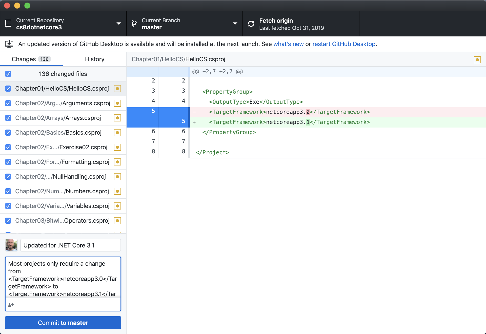

# December 2019 update for .NET Core 3.1
.NET Core 3.0 was released on 23rd September 2019. This version is a Current release meaning that three months after a subsequent release it loses official support. 
.NET Core 3.1 was released on 3rd December 2019. This version is a Long Term Support (LTS) release meaning that it will be supported for three years. Microsoft recommends all .NET Core developers upgrade to .NET Core 3.1 as soon as possible.
- [Announcing .NET Core 3.1](https://devblogs.microsoft.com/dotnet/announcing-net-core-3-1/)
- [Download .NET Core 3.1](https://dotnet.microsoft.com/download/dotnet-core/3.1)
## Chapters 1 to 16, 18 and 19
All but three of the chapters in the fourth edition of this book were written using .NET Core 3.0. 
Any projects that target .NET Core 3.0 must upgrade to .NET Core 3.1 by 3rd March 2020.
To upgrade a console application from .NET Core 3.0 to .NET Core 3.1 simply requires a small change in your project file.
Change this:
```
<TargetFramework>netcoreapp3.0</TargetFramework>
```
To this:
```
<TargetFramework>netcoreapp3.1</TargetFramework>
```

## Chapter 17 and Piranha CMS
Chapter 17 was written using Piranha CMS 7.0 that targets .NET Core 2.2. This version loses support three months after the release of .NET Core 3.0 meaning on 23rd December 2019. 
The solution code for this chapter has been updated to use Piranha CMS 8.0 which targets .NET Core 3.1.
[Announcing 8.0 for .NET Core 3.1](http://piranhacms.org/blog/announcing-80-for-net-core-31)
### Changes for Chapter 17
As well as targetting .NET Core 3.1, Piranha CMS 8.0 has the following changes that affect Chapter 17:
- Page 567. The **Save** button does not have a dropdown arrow with **Preview** as an option. Instead, there is a separate Preview icon button.
- Page 569. When creating a new user, the prompt placeholder text has not been localized into English.
- Page 579. `ArchivePage<T>` has been replaced with a `Page<T>`, the `[PageType]` attribute now has a parameter named `IsArchive` that should be set to `true`, and a property named `Archive` of type `PostArchive<DynamicPost>`. 
- Page 587. The `[Field]` attribute has moved from the `Piranha.AttributeBuilder` namespace to the `Piranha.Extend` namespace.
- Page 588. Now that Piranha CMS 8.0 is compatible with .NET Core 3.1, we can reuse both the entities and database context libraries instead of needing to recreate a local database context.
```
<ItemGroup>
  <ProjectReference Include=
    "..\NorthwindEntitiesLib\NorthwindEntitiesLib.csproj" />
  <ProjectReference Include=
    "..\NorthwindContextLib\NorthwindContextLib.csproj" />
</ItemGroup>
```
- Page 589. The `[Region]` attribute has moved from the `Piranha.AttributeBuilder` namespace to the `Piranha.Extend` namespace.
- Page 595. In Piranha CMS 7.0, `PageTypeBuilder` was used to manually add each page type. This has been replaced with `ContentTypeBuilder` that only needs to have an assembly added and all content types in that assembly will be registered.
- Page 597. The `GetAllAsync()` extension method has been replaced by `GetAllByFolderIdAsync()` with no folder ID passed.
## Chapter 20 and Windows Desktop Apps
### Windows Forms and WPF apps
As with console applications, for Windows Forms and WPF apps, simply change the target framework to 3.1.
### Universal Windows Platform apps
UWP apps use a custom version of .NET Core.
## Chapter 21 and Mobile apps
Mobile apps currently use Xamarin so they are not affected by .NET Core 3.1.
